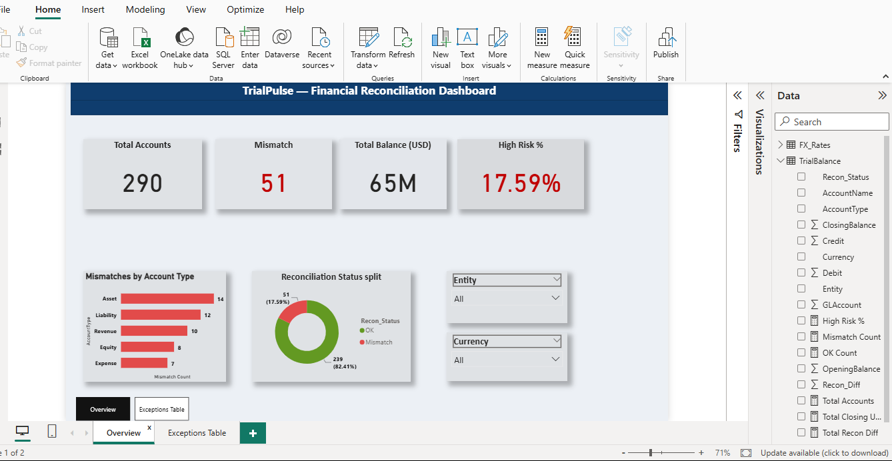
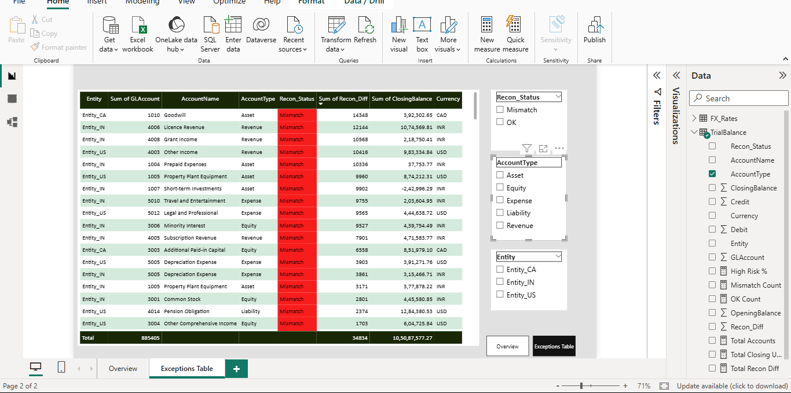
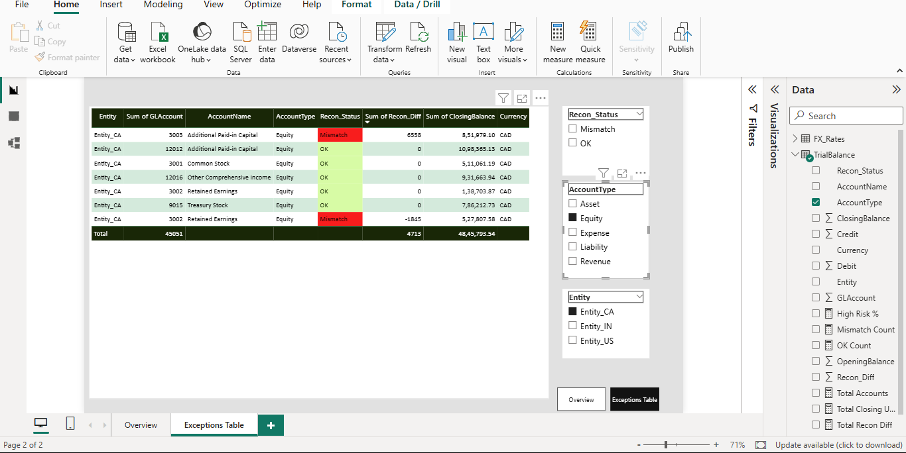
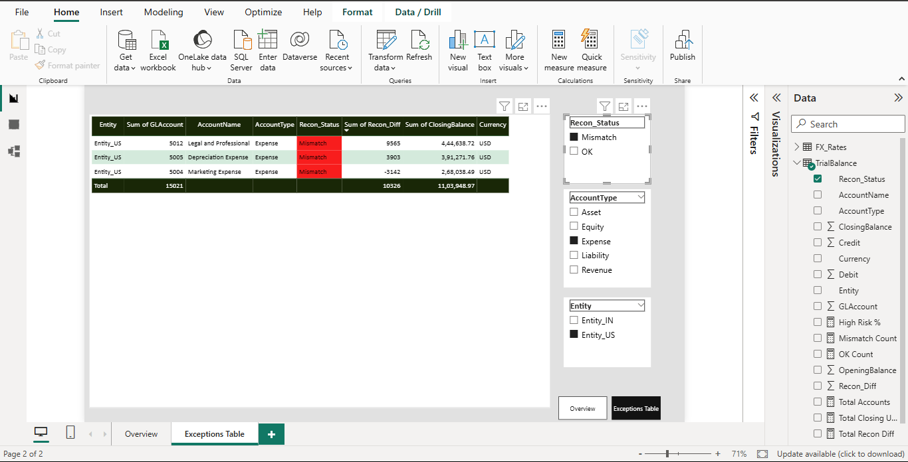

# TrialPulse — Financial Reconciliation Dashboard
A Power BI dashboard that reconciles multi-entity, multi-currency
Trial Balance data and surfaces accounts with material mismatches.

## Business Problem
Finance teams consolidating trial balances across multiple entities
and currencies must manually compare GL accounts for discrepancies.
This is error-prone and time-consuming at scale. TrialPulse automates
the reconciliation check — flagging every mismatch, quantifying the
gap, and letting reviewers drill into exceptions by entity, account
type, and currency in seconds.

## Data
Synthetic Trial Balance dataset covering 3 entities and 3 currencies,
with a companion FX rates table for USD normalization:

| Table | Description |
|---|---|
| TrialBalance | 290 accounts across Entity_CA, Entity_US, Entity_IN |
| FX_Rates | 3 currencies — CAD (0.74), USD (1.00), INR (0.012) |

Account types: Asset · Liability · Equity · Revenue · Expense.
Fields: GLAccount, AccountName, OpeningBalance, Debit, Credit,
ClosingBalance, Currency, Recon_Status, Recon_Diff.

## Approach
1. **Data prep** — Excel: column mapping, currency tagging, FX
   rate lookup table built for CAD / USD / INR
2. **Recon logic** — `Recon_Diff` computed per account; `Recon_Status`
   set to `Mismatch` where diff ≠ 0, else `OK`
3. **USD normalization** — `Total Closing USD` measure applies
   `Rate_to_USD` via relationship between TrialBalance and FX_Rates
4. **Risk flag** — `High Risk %` = Mismatch Count ÷ Total Accounts
5. **Power BI dashboard** — two-page report: Overview KPIs +
   filterable Exceptions Table with slicers for Entity, AccountType,
   and Recon_Status

## Key Findings
- **51 of 290 accounts** flagged as Mismatch (17.59% High Risk)
- **Total consolidated balance**: $65M USD across all entities
- **Assets** carry the most mismatches (14), followed by
  Liabilities (12) and Revenue (10)
- **82.41% of accounts** reconciled cleanly (239 OK)
- Exceptions drillable by entity (CA / US / IN) and account type

## Tools
Power BI · DAX · Excel

## Dashboard

[📄 View Full Dashboard (PDF)](public/TrialPulse.pdf)